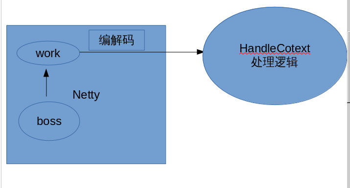
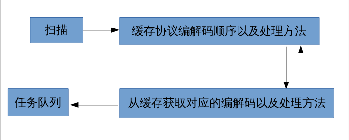
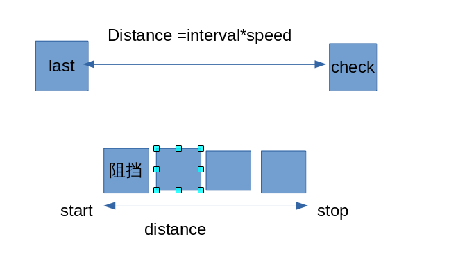

- 项目整体结构

  网关收发信息-------dipstach------->逻辑处理线程

  


- 网关
  - Netty
     使用**Netty**框架进行I/O读写

     拆包使用的Netty带的工具**LengthFieldBasedFrameDecoder**
   - 协议
      协议格式如下:

| 包长度  | cmd  |  内容  |
| :--: | :--: | :--: |
| int  | int  | xxx  |
​		  

   - 编解码
      参考项目，启动的时候缓存对应的编解码方法，然后根据**cmd**来获取协议对应的编解码缓存来进行编解码。
      ​    
      ```java
      @Message(cmd = CmdConstant.HEART_REQ)
      public class ReqHeartbeatMessge extends BaseMessage {
      	private long time;
      }
      ```

      协议信息会缓存在**MessageWrapper**里，它的结构如下：
      ​    
      ```java
      private class MessageWrapper{
      		public List<Codec> list;
      		public Field[] fields;
      		public Class<Message> clazz;
      		public int cmd; //补锅，作为Message内部包装类的标记
      }
      ```

      基础编解码支持**int,short,long,string,byte**，并支持包含这些基础编解码工具的**封装类**，也支持**List**。
      ​    
      ```java
      public interface Codec {
      	public void decode(ByteBuffer buf, Object m, Field f);
      	public void encode(ByteBuffer buf, Object m, Field f);
      }
      ```

      - buf指的是要被编码/解码的二进制对象
      - m指要被解码/编码的对象
      - f是被编解码的对象成员变量

      ​

  - 分发处理

     - 通过协议里的**cmd**，通过反射获取缓存中对应的执行方法，然后分发给**逻辑处理线程处理**：

       ```java
       HandlerFactory.getInstance().dispatch(message, sessionId);
       ```

       也就是说，netty的**work**线程不负责处理逻辑，只是把协议包分发到对应的处理线程就完事。

       ps：netty的线程只会处理**心跳协议**，避免Debug的时候挂起逻辑线程导致双端掉线。

       ​

  - 网关总结

     > 通过在应用初始化的时候类扫描缓存我们需要的相关数据，通过**反射**来**编解码**和**分发**处理对应的协议信息，这种类似**MVC**的模式可以解耦I/O和逻辑业务之间的联系。

     ​

     通过这种方式，每添加一个新的**协议**和对应的**处理方法逻辑的时候**，只需要走以下步骤：

     - 新建一个协议类继承**BaseMessage**，打上对应的**@Message**注解，分配唯一的**cmd**，留出空构造方法;
     - 新建一个处理类(不新建也行)，打上**@MessageHandler**注解，然后对应的处理方法上，打上**@MessageInvoke**注解，并表明对应的协议**cmd**，函数参数为**(int, BaseMessage)**即可。


 


- HandleContext

  > HandleContext是处理所有的逻辑业务的入口。

  - Processor

    > Processor继承自**Thread**，持有一个**DelayQueue**队列来缓存需要处理的任务。对外提供添加任务的接口，支持如下类型任务：

    - 单/多次有/无延迟任务

      - 处理协议（单次无延迟任务）
      - 掉线处理（单次无延迟任务)

    - 定时任务

      - 行走检测任务
      - 子弹检测任务
      - npc寻路任务

      ​

  

- 行走检测

  - 客户端发送行走像素距离
  - 添加到服务端对应的一个行走处理队列
  - 定时100ms扫描，根据两次扫描之间间隔时间，配合玩家对应的速度，计算该走多少像素点
  - 计算本次该走的像素点可不可走：
    - 如果可走，走动，从队列中去除已走动的距离，推送给地图中的所有玩家，同步画面;
    - 如果不可走，去除该玩家所有待处理的跑步信息。

  </br>

- 子弹检测
    - 客户端发送子弹，服务端接送后首先进行子弹冷却校验，限制客户端的开枪间隔时间
      - 校验不通过，忽略本次子弹;
      - 校验通过，加入到地图中待检测子弹队列中：
        - 定时50ms扫描，根据两次扫描间隔之间的时间差，计算子弹该走的像素路程;
        - 计算子弹扫过的矩形范围内是否有**其他坦克，阻挡，或者越界**：
          - 满足任一条件，子弹消失，并推送给客户端同步界面
          - 否则，推送给客户端子弹的最新坐标。

    </br>

- npc行走检测
    - 游戏开始的时候，注册npc进入地图，然后指定该NPC追踪的对象是哪个玩家
    - 定时100ms寻路，设置NPC的行走速度为玩家的**1/2**。扫描玩家坐标，通过**A*寻路**，找到最短路径，加入到**NPC**待行走的步子队列中，然后交由行走检测处理。
      - 如果两次扫描中目标玩家位置未改变，跳过本次寻路
      - 否则清空**NPC**的待行走路径，加入最新寻路得到的**路径**
      - 当检测到**NPC**离目标玩家**一定距离**之内的时候，触发伤害，并休眠一定的时间再进行追踪。

    ​


  ps：游戏是两人对战，各有一个**NPC**追踪玩家，定义为第三方警察的角色，不能让警察靠近，一旦靠近减少生命值。任意一方生命值为0，另一方获胜

​	  	
